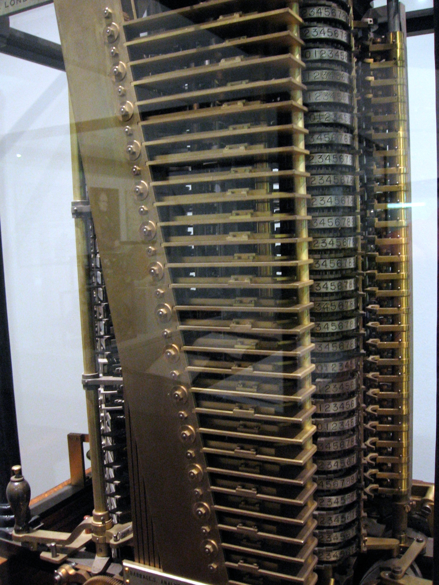
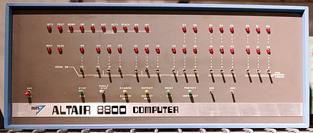

# oh no!
## another programming language


# 4programmers.net

//TODO pic


# typical drama post 

(2-4 each month)


> Mam 32 lata, żonę i urodziło mi się dziecko (tzn nie urodziło się samo tylko zostało urodzone ściślej mówiąc), nie mam czasu na doszkalanie się oraz naukę nowych technologii. Co zrobić ze swoim życiem? Jak wskoczyć na pozycję bardziej menagerskie gdzie nie potrzeba ciągłej technicznej nauki?


- why do always get new technologies ?

- why always new frameworks ?
 
- why do we have to learn new programming languages ?

- who creates all those (niche) languages? 
//TODO rethink


## remember your first programming language?


```basic
10 PRINT "HELLO WORLD"
20 PRINT
30 GO TO 10

```


## and your favourite language?


## your favourite language

- you know it well
- you like it
- you *dislike* other
- you can do all you want in
- you would do all in it


```
> 99 bottles of beer on the wall, 99 bottles of beer.
Take one down and pass it around, 98 bottles of beer on the wall.

98 bottles of beer on the wall, 98 bottles of beer.
Take one down and pass it around, 97 bottles of beer on the wall.

97 bottles of beer on the wall, 97 bottles of beer.
Take one down and pass it around, 96 bottles of beer on the wall.

96 bottles of beer on the wall, 96 bottles of beer.
Take one down and pass it around, 95 bottles of beer on the wall.

95 bottles of beer on the wall, 95 bottles of beer.
Take one down and pass it around, 94 bottles of beer on the wall.

```

song in 1500 different programming languages ...

[99 bottles of beer](http://www.99-bottles-of-beer.net/)


# let's talk about hardware


# first computers


<!-- .element class="smaller" -->


## Analitical engine

Designed in 1837+ by Charles Babbage
- first  planned computer 
- mechanical 
- not finished


```
N0 6
N1 1
N2 1
×
L1
L0
S1
-
L0
L2
S0
L2
L0
CB?11
```

first program ever?


# programming language


```
 λn. n (λfab. (f b ((λmnfx. n f (m f x)) a b))) (λxy. x) (λfx. x) (λfx. f x)
  
```
<!--(lambda n. (n (lambda  f a b. (f b ((lambda m n f x. n f (m f x)) a b))) (lambda  x y. x) (lambda f x. x) (lambda f x. (f x)))) (lambda f x.(f (f x))) --->


## Lambda calculus

1930 Church

- x
- (λx.M)
- (M N)


# λ - calculus 

 - actually a programming language
 - minimal (turing tar-pit) //TODO check
 - low level language of mathematics
 - needs no computer to run!


# back to metal


## Atanasoff-Berry Computer
<!-- .element class="smallPic" -->

1939!


## Z3 Electromechanical 


Konrad Zuse / Berlin 1941


Zuse designed first high level programming language 


## Next

- Colossus 1943
- ENIAC 1945
- EDVAC
- BINAC
- ...


# Programming

//TODO put some switches


# modern example


```6502
a2 0a 18 a0 00 a9 01 ca f0 08 84 fb a8 65 fb 4c 14 08  
a8 a9 00 20 91 b3 20 dd bd a9 00 a0 01 20 1e ab 60
```
- 6510<!-- .element: class="fragment" data-fragment-index="1" -->
- Must be put in memory $080d<!-- .element: class="fragment" data-fragment-index="2" -->
- f0 is a conditional branch<!-- .element: class="fragment" data-fragment-index="3" -->
- 4c is an unconditional jump<!-- .element: class="fragment" data-fragment-index="4" -->


## Machine code


## Machine code

- Easy to learn
- Conditional branches / loops are hard to calculate
- Codes hard(?) to remember (150 opcodes on 6510, ?>4k on i7  )
- mechanical/boring job
- hard to program


# we need 


# another programming language


```asm
tmp = $fb

Start:ldx #10 ;  decimal!
         clc
         ldy #$0
         lda #$1
loop: dex
         beq end
         sty tmp
         tay
         adc tmp
         jmp loop
end:  tay ; result is in Y - lets print it
         lda #$00 
         jsr $B391 ; int to float
         jsr $bddd ; FAC to petscii
         lda #$00
         ldy #$01
         jsr $AB1E ; print petscii
         rts
``` 


## Assembly (1949)


For noobs that cannot remember machine codes


# Reason #1

Let compiler do automatic and boring job
 
So that we code faster

//TODO pic (achievment)


## Assembly

- As fast as machine code
- Some minimal portability (!)
- Registers
- Arithmetic calculations
- Comments needed (!)


# Meanwhile in hardware


# Another programming language


```
      SUBROUTINE FIB(N)
      INTEGER N,I,F0,F1,TMP
      I=0
 1060 IF(N.GT.0)THEN
      GOTO6129
      ELSE 
      GOTO7290
      ENDIF
 6129 WRITE(*,3502) 1
      N=N-1
      I=I+1
      IF(I.LT.2)THEN
      GOTO1060
      ELSE
      GOTO9321
      ENDIF
 9321 CONTINUE
      F0 = 1
      F1 = 1
      I = 2
 3502 FORMAT(I6)
      N=N+1
 2714 TMP = F1
      F1 = F1 + F0
      F0 = TMP
      WRITE(*,3502) F1
      IF(I.LT.N)THEN
      I = I + 1
      GOTO2714
      ENDIF
 7290 CONTINUE
     
      ENDSUBROUTINE
      PROGRAM MAIN
      INTEGER N
      N=10
      CALL FIB(N)
      END
```

from https://gist.github.com/wrathematics/ac621cd583c4b9e3b5eb


## FORTRAN (1957)


## FORTRAN

- simple arithmetic
- compiled to very fast code
- funny `type system` *variables starting on I-N are INTEGER*<!-- .element: class="fragment" data-fragment-index="1" -->
- GOTO hell
- *scientific*


# Another programming language


```
       IDENTIFICATION DIVISION.
           PROGRAM-ID. "Fibonacci".
       ENVIRONMENT DIVISION.
       DATA DIVISION.
       WORKING-STORAGE SECTION.
       01  ix                    BINARY-C-LONG VALUE 0.
       01  first-number          BINARY-C-LONG VALUE 0.
       01  second-number         BINARY-C-LONG VALUE 1.
       01  temp-number           BINARY-C-LONG VALUE 1.
       01  display-number        PIC Z(19)9.
       PROCEDURE DIVISION.
      
       START-PROGRAM.
           MOVE first-number TO display-number.
           DISPLAY display-number.
           MOVE second-number TO display-number.
           DISPLAY display-number.
           PERFORM VARYING ix FROM 1 BY 1 UNTIL ix = 90
               ADD first-number TO second-number GIVING temp-number
               MOVE second-number TO first-number
               MOVE temp-number TO second-number
               MOVE temp-number TO display-number
               DISPLAY display-number
           END-PERFORM.
       STOP RUN.
```


# COBOL (1959)


# COBOL

- fast code after compilation
- reading as english (military version)
- no need to comment


# Reason #2

Make programming easier


# Meanwhile in hardware


# Punch card driven


Guess what? 


# ... another language


```
defun fibonacci(n)
  (cond
    ((eq n 1) 0)
    ((eq n 2) 1)
    ((+ (fibonacci (- n 1)) (fibonacci (- n 2))))))))
```


# LISP (1958)


# Reason 3

- New(?) concept. 
- New paradigm.
- Elegance.


But we will not talk about LISP.


# and again


```
PROC fibo = (INT n) INT :
    # prints out the Fibonacci sequence up to n. #
    BEGIN
        INT a := 0, b := 1;
        FOR i TO n-1 DO
            # print((whole(i, 0), " => ", whole(b, 0), new line));#
            INT c = a + b;
            a := b;
            b := c
        OD;
        b
    END;
print(whole(fibo(10),0))
```


# ALGOL (1958)


# ALGOL

Academic language of 60'
- ALGOL 58 *better FORTRAN*
- ALGOL 60
- ALGOL 68 *great disaster*


`Man or boy test` by Donald Knuth 


# ALGOL 68

- way ahead of any language of that time
- design by community
- first design then implementation (few years later)
- lot of funny operators 


Reality


Disappointment


# Meanwhile in hardware


//TODO transistor


# Explosion


## ALGOL W

- Niklaus Wirth and Tony Hoare


`NULL` - I call it my billion-dollar mistake


## BCPL  (1967)

```bcpl
GET "libhdr"

LET start() = VALOF
{ FOR i = 0 TO 15 DO writef("%n, ", fibonacci(i))
  writef("...*n")
  RESULTIS 0
}

AND fibonacci(n) = n<2 -> 1, fibonacci(n-1)+fibonacci(n-2)

```


- only one type
- language for os programming
- hungarian notation 


```
200 IF N<0 THEN F=-1:RETURN
210 IF N<2 THEN F=1:RETURN
220 N=N-1:GOSUB 200
230 N=N+1:F=F*N
240 RETURN
```


# BASIC (1964)


- Programming for masses
- interpreter
- GOTO
- uninitialized variables


//TODO 8080




# Altair 8800


MS heroes//TODO


# Everybody wanted basic


# Commodore needs basic
//TODO CBM logo


# The deal

Microsoft wanted $3 for each Commodore computer sold with BASIC in ROM


<!-- .element width="200px"-->
<!-- .element width="300px"-->

(from https://tech.wp.pl/internet-commodore-i-atari-nie-powstalyby-bez-polakow-6035074860253825g/2)


Microsoft got $25 000 for unlimited licence
Commodore could include Microsoft BASIC with updates in all their machines based on 6502 processor
//TODO recheck

Commodore sold ~ 20 mln of C64 machines - and milions of others


Microsoft almost bankrupted


And angry Bill Gates put an easter egg in machine code...

//TODO pet link


And they have  learned how to make business


# Era of BASIC 
## 1977-1995


GOTO considered harmful

(WTF?)<!-- .element: class="fragment" data-fragment-index="1" --> 


# another programming language?


```
function FibonacciNumber(const n: integer): integer;
begin
	// recursive case
	if n > 1 then
		result := (FibonacciNumber(n-1) + FibonacciNumber(n-2))
	// base case
	else if n = 0 then
		result := 0
	else
		result := 1;
end;
```


# Pascal (1970)

- No more  GOTO errors
- Variable declared
- structural programming


# Reason 4

Prevent errors


# Structural programming

Makes impossible  to create spaghetti code


Oh really?


# Better alternative


```
10 COMEFROM 40
20 INPUT "WHAT IS YOUR NAME? "; A$
30 PRINT "HELLO, "; A$
40 REM
```

If `GOTO` is bad...


# yet another language

```
XXXVII

    DO .9 <- #16
    DO .10 <- #0
    DO .11 <- #1

(1) PLEASE READ OUT .11
    DO .1 <- .10
    DO .2 <- .11
    PLEASE (1009) NEXT
    DO .10 <- .11
    DO .11 <- .3

    DO (3) NEXT
    DO (1) NEXT

(3) DO (4) NEXT
    PLEASE GIVE UP

(4) DO .1 <- .9
    DO .2 <- #1
    PLEASE (1010) NEXT
    DO .9 <- .3
    DO .1 <- '.9~.9'~#1
    PLEASE (1020) NEXT
    DO RESUME .1
```


# Intercal  (1972)

One of the first Esoteric Languages


//todo forth


# meanwhile in hardware

//hard disk

# and another programming language

```c

/* C implementation QuickSort */
#include<stdio.h> 
  
// A utility function to swap two elements 
void swap(int* a, int* b) 
{ 
    int t = *a; 
    *a = *b; 
    *b = t; 
} 
  
/* This function takes last element as pivot, places 
   the pivot element at its correct position in sorted 
    array, and places all smaller (smaller than pivot) 
   to left of pivot and all greater elements to right 
   of pivot */
int partition (int arr[], int low, int high) 
{ 
    int pivot = arr[high];    // pivot 
    int i = (low - 1);  // Index of smaller element 
  
    for (int j = low; j <= high- 1; j++) 
    { 
        // If current element is smaller than or 
        // equal to pivot 
        if (arr[j] <= pivot) 
        { 
            i++;    // increment index of smaller element 
            swap(&arr[i], &arr[j]); 
        } 
    } 
    swap(&arr[i + 1], &arr[high]); 
    return (i + 1); 
} 
  
/* The main function that implements QuickSort 
 arr[] --> Array to be sorted, 
  low  --> Starting index, 
  high  --> Ending index */
void quickSort(int arr[], int low, int high) 
{ 
    if (low < high) 
    { 
        /* pi is partitioning index, arr[p] is now 
           at right place */
        int pi = partition(arr, low, high); 
  
        // Separately sort elements before 
        // partition and after partition 
        quickSort(arr, low, pi - 1); 
        quickSort(arr, pi + 1, high); 
    } 
} 
```

from https://www.geeksforgeeks.org/quick-sort/
 

# C (1969)

- Better os programing support
- better low level hardware use
- mixes easily with assembly
- (void*) - and where is your type now
- life is too short for malloc
- limited encapsulation
- verbose

# so another language


```
#include <iostream>     // std::cout
#include <algorithm>    // std::sort
#include <vector>       // std::vector

bool myfunction (int i,int j) { return (i<j); }

struct myclass {
  bool operator() (int i,int j) { return (i<j);}
} myobject;

int main () {
  int myints[] = {32,71,12,45,26,80,53,33};
  std::vector<int> myvector (myints, myints+8);               // 32 71 12 45 26 80 53 33

  // using default comparison (operator <):
  std::sort (myvector.begin(), myvector.begin()+4);           //(12 32 45 71)26 80 53 33

  return 0;
}

```


from http://www.cplusplus.com/reference/algorithm/sort/


# C++

- object oriented programming
- provide encapsulation
- better modularization
- life is too short for ~~malloc~~  new/delete
- operators overloading hell
- meta-programming
- portability
- security


# meanwhile in hardware

//TODO network


# Java / `C#`
 
 - break with C compatibility
 - portability 
 - garbage collection
 - great standard library
 - security
 - better multithreading

# Reason 5


//TODO kto robi te wszystkie niczowe języki


#  and now the most sucessful language ever

```
[][(![]+[])[+[]]+([![]]+[][[]])[+!+[]+[+[]]]+(![]+[])[!+[]+!+[]]+(!![]+[])[+[]]+
(!![]+[])[!+[]+!+[]+!+[]]+(!![]+[])[+!+[]]][([][(![]+[])[+[]]+([![]]+[][[]])
[+!+[]+[+[]]]+(![]+[])[!+[]+!+[]]+(!![]+[])[+[]]+(!![]+[])[!+[]+!+[]+!+[]]+
(!![]+[])[+!+[]]]+[])[!+[]+!+[]+!+[]]+(!![]+[][(![]+[])[+[]]+([![]]+[][[]])[+!+[]+
[+[]]]+(![]+[])[!+[]+!+[]]+(!![]+[])[+[]]+(!![]+[])[!+[]+!+[]+!+[]]+(!![]+[])[+!+[]]])
[+!+[]+[+[]]]+([][[]]+[])[+!+[]]+(![]+[])[!+[]+!+[]+!+[]]+(!![]+[])[+[]]+(!![]+[])
[+!+[]]+([][[]]+[])[+[]]+([][(![]+[])[+[]]+([![]]+[][[]])[+!+[]+[+[]]]+(![]+[])[!+[]+!+[]]+
(!![]+[])[+[]]+(!![]+[])[!+[]+!+[]+!+[]]+(!![]+[])[+!+[]]]+[])[!+[]+!+[]+!+[]]+
(!![]+[])[+[]]+(!![]+[][(![]+[])[+[]]+([![]]+[][[]])[+!+[]+[+[]]]+(![]+[])[!+[]+!+[]]+
(!![]+[])[+[]]+(!![]+[])[!+[]+!+[]+!+[]]+(!![]+[])[+!+[]]])[+!+[]+[+[]]]+(!![]+[])
[+!+[]]]((![]+[])[+!+[]]+(![]+[])[!+[]+!+[]]+(!![]+[])[!+[]+!+[]+!+[]]+(!![]+[])
[+!+[]]+(!![]+[])[+[]]+(![]+[][(![]+[])[+[]]+([![]]+[][[]])[+!+[]+[+[]]]+(![]+[])
[!+[]+!+[]]+(!![]+[])[+[]]+(!![]+[])[!+[]+!+[]+!+[]]+(!![]+[])[+!+[]]])[!+[]+!+[]+[+[]]]+[]

```

//TODO Bernard Eich picture


# JavaScript

 - ECMA
 - LISPy in core
 - ugly in details/ bad parts
 - Dynamicly typed
 - wasted chance


# Reason 6

Niche.


# Types

Scripting languages vs Compiled languages
Dynamicly typed vs Staticly typed
Strongly typed vs Weakly typed

//TODO types twitts

Less types more tests
//TODO picture


# Is there anything better?


//TODO put scala
```
var h = "Hello, "
var w = World!"
var z = h.length() + w.length()
console.log(h +w + z)

```

# Scala

- FP , OOP hybrid
- type inference
- favors immutability
- comnpiles to JVM
- comnpiles to JS
- compiles to llvm (`*`)
- strongly typed without verbosity
- complex
- too complex?


#  and another language

```
var h = "Hello, "
var w = World!"
var z = h.length() + w.length()
console.log(h +w + z)

```


# TypeScript

- Compiles to JS
- staticly typed
- but weakly (`*`)


# Meanhile in hardware

//TODO multicore


//TODO put haskell

# Haskell

Academic...?


# Not tolked about

- Clojure
- Scheme
- Kotlin
- Swift
- Prolog
- Python
- Rust
- .. 
 
 
# what do you think about yet another language?
 
   
## Language

 - syntax
 - semantics
 - library
 - community *!*


# Evolution network

<div class="langNetwork" />


//TODO co jest szybsze?

# Towards bug free

 - opcode errors  -> asm 
 - GOTO spaghetti  -> C
 - lack of encapsulation -> C++
 - memory leaks -> Java
 - nullpointerexception -> Kotlin 
 - concurenncy problems -> Rust


# end of privacy

for your code


Comopilers want to know more.

malloc() - just function call
new A(); - you allocate object


# Better productivity

- Easier maths -> Fortran
- easier algorithms -> Algol
- faster prototyping -> Visual Basic
- data processing -> Python

# New hardware posibilities

- limted mem -> asm, cobol, fortran
- faster cpu -> Pascal, C
- nore memory -> C++, Java
- network /multicore -> Scala, Haskell     


If you use new hardware, and new language possibilites...

You wil have new types of bugs that are hard to even imagine now.

And You will need:
 

# yet another language


# For You

Languages are there not to destroy your life


# Master one language well

# Read and understand languages you work with


I mean You don't know JavaScript


# Try different ones

C# / Java - try Haskell
C / Pascal - try Java/ C#
Haskell/Ocaml - try Rust
Scala - try Clojure
Javascript - Scala (or asm)

# Really different

PROLOG
Rust
Clojure

# Language changes the way you think

//TODO example ???

# Be brave
 
 In your companies you do:
  - prototypes,
  - dev tools,
  - hackatons
  - trainings


# Dead languages

Languages never die - they only fade away.


Or turn `zombies`


Last COBOL specification was released 2016


There is still a lot of COBOLERs.


# What is next?

 - AI
 - 256 cores
 - more GPU
 - FPGAs?
 - IOT
 - security
 - privacy
 
 
  
 # Why don't we programm Haskell?
 
 
 Industry likes small steps
 
 
 - C 
 - C++
 - Java/C#
 - Scala/F#
 - ~~Scala/F#~~
 - Kotlin ??  
 
 
 
 